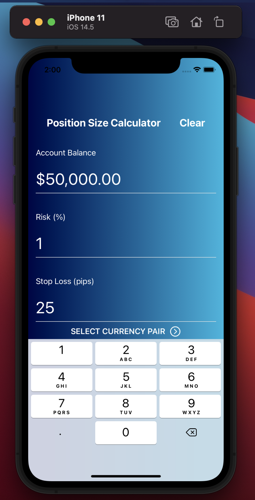
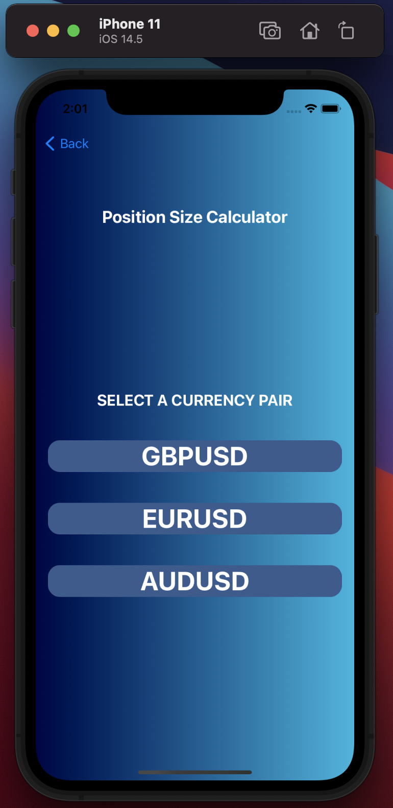
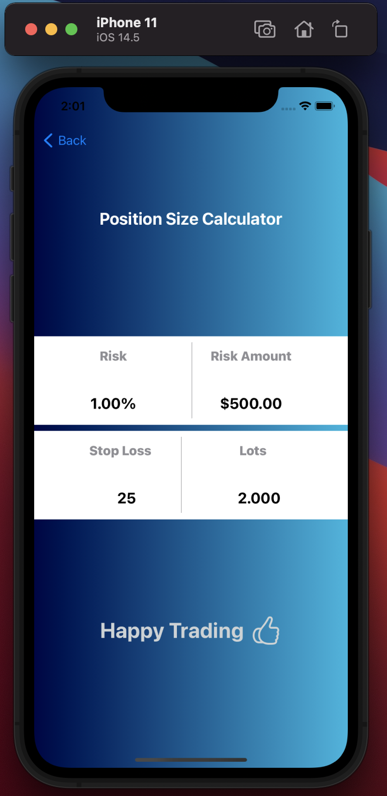

# Position Size Calculator 📉

An iOS app designed to help forex traders find a suitable position size per trade based on the currency pair, risk percentage, and stop loss. 

https://user-images.githubusercontent.com/34800051/124772195-b6e94880-df33-11eb-8ece-fb7cdc343e27.mp4

## Requirements
* iOS 13+
* Xcode 10+

## Installing and Running the program

* Download and extract the ZIP file from the [repository](https://github.com/aaronowusu/Position-Size-Calculator.git)
* Open **Position Size Calculator.xcodeproj** with Xcode 10 or later
* Run the app on an iOS simulator or a trusted device that is connected to your Mac

## Authors

Aaron Owusu

If you're having any kind of trouble, please feel free to contact me via [email](mailto:aaronoseiowusu@outlook.com).

## Acknowledgments

* [Youjinp](https://github.com/youjinp) - (CurrencyTextField.swift)

## Screenshot

